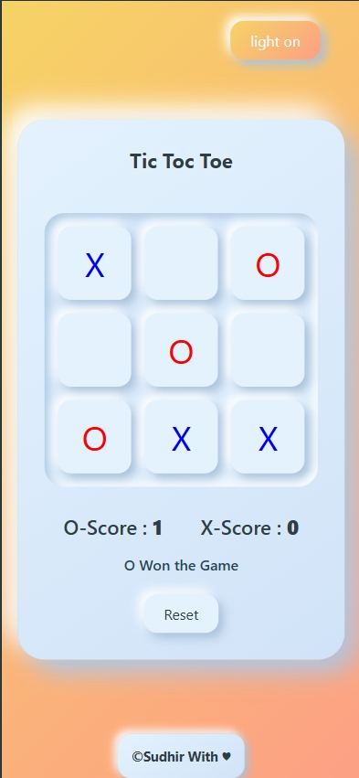

# Tic-tac-toe

A fun and interactive web-based Tic Tac Toe game with light mode toggle and real-time score tracking. Built with HTML, CSS, and JavaScript. Switch themes, play solo or with a friend, and reset anytime to keep the challenge going!

## ⚡️Features
- Light Mode Toggle: Switch between two beautiful background themes with a single click
- Two-Player Gameplay: Classic X vs O turns with intuitive UI intraction
- Score Tracking: Keeps track of each player's wins across rounds

## Screenshots

   
   
   
   

## 👩‍💻Technologies Used
- HTML5
- CSS3
- JavaScript

## 🚀 Getting Started
### Installation
1. Clone the repository:
   `git clone https://github.com/Sudhir302/X-O.git`
2. Install dependencies:
   _No Dependencies_
3. Run the app:
   _Go Live_

## License
## 📄 License

This project is licensed under the MIT LICENSE - see the [MIT License](./LICENSE) for details.
## Contact
Sudhir Chaudhary - csudhir302@gmail.com
